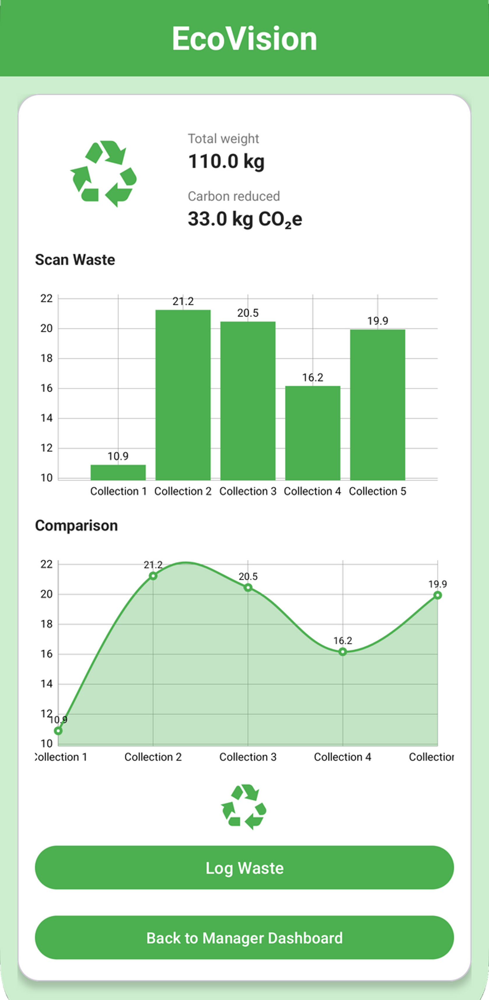

# 🌿 EcoVision – Smart Recycling & Waste Tracker

> **A mobile application designed to promote recycling awareness and enhance waste management efficiency through smart data tracking.**


## 📖 Project Overview
**EcoVision** is a sustainability-focused mobile application intended to help communities and organizations adopt eco-friendly practices. The system enables users to track their daily waste disposal habits, locate nearby recycling points, and monitor their personal environmental impact.

This project was built to demonstrate a complete software solution, combining a robust **Relational Database** backend with a user-friendly **Android Mobile** frontend.

## ✨ Key Features
*   **♻️ Waste Tracking:** Users can log different types of waste (plastic, paper, glass) to track their disposal habits.
*   **📍 Recycling Locator:** Helps users find the nearest recycling centers and disposal points.
*   **📊 Impact Dashboard:** Visualizes data on how much waste the user has recycled versus thrown away.
*   **👤 User Profiles:** Custom accounts to save history and track progress over time.
*   **🌱 Eco-Tips:** Provides educational content on how to recycle correctly.

## 🛠️ Tech Stack
*   **Mobile Development:** Android Studio (Java/XML)
*   **Database Management:** MySQL / Standard SQL
*   **Design Methodologies:** ER Modeling, Normalization (3NF), Relational Mapping
*   **Tools:** Git, GitHub

## 🗄️ Database Architecture
Since this project focuses on **Database Systems**, significant engineering went into the data structure to ensure efficiency and scalability.

### Core Concepts Applied:
1.  **ER Modeling:** Designed a comprehensive Entity-Relationship diagram to map users, waste types, locations, and logs.
2.  **Normalization:** Applied database normalization (up to 3rd Normal Form) to reduce redundancy and ensure data integrity.
3.  **SQL Implementation:** utilized complex SQL queries for data retrieval, updates, and tracking user statistics.


## 📱 App Screenshots
| Login Screen | Dashboard | Recycling Map |
|:---:|:---:|:---:|
|  |  |  |


## 🚀 How to Run
1.  **Clone the Repository:**
    ```bash
    git clone https://github.com/yourusername/EcoVision.git
    ```
2.  **Database Setup:**
    *   Import the provided `database_schema.sql` file into your MySQL server.
    *   Update the database connection string in the Android project configuration.
3.  **Run the App:**
    *   Open the project in **Android Studio**.
    *   Build and run on an Emulator or Physical Device.

## 👨‍💻 Contributors
*   **ZEINA** - *Mobile App Development & Database Design*

---
*This project was developed as part of the Database Systems curriculum, focusing on practical application of data organization and system development.*
